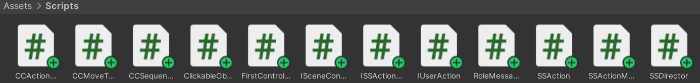

# 【Unity】《牧师与魔鬼》(动作分离版) - Lab3 博客 

Video URL：https://www.bilibili.com/video/BV1vW15YXE5z/

---

## 一、游戏要求 

阅读以下游戏脚本

>Priests and Devils
>
>Priests and Devils is a puzzle game in which you will help the Priests and Devils to cross the river within the time limit. There are 3 priests and 3 devils at one side of the river. They all want to get to the other side of this river, but there is only one boat and this boat can only carry two persons each time. And there must be one person steering the boat from one side to the other side. In the flash game, you can click on them to move them and click the go button to move the boat to the other direction. If the priests are out numbered by the devils on either side of the river, they get killed and the game is over. You can try it in many > ways. Keep all priests alive! Good luck!

程序需要满足的要求：

1. 列出游戏中提及的事物（Objects）;

2. 用表格列出玩家动作表（规则表），注意，动作越少越好;
  
3. 请将游戏中对象做成预制;
 
4. 在场景控制器 LoadResources 方法中加载并初始化长方形、正方形、球及其色彩代表游戏中的对象;
   
5. 使用 C# 集合类型 有效组织对象;
   
6. 整个游戏仅 主摄像机 和 一个 Empty 对象，其他对象必须代码动态生成！！！整个游戏不许出现 Find 游戏对象， SendMessage 这类突破程序结构的 通讯耦合 语句;

7. 请使用课件架构图编程，不接受非 MVC 结构程序;

8. 注意细节，例如：船未靠岸，牧师与魔鬼上下船运动中，均不能接受用户事件！

## 二、游戏设计 

1. 列出游戏中提及的事物（Objects）：

   牧师，魔鬼，船，两岸；

2. 用表格列出玩家动作表（规则表），注意，动作越少越好;

   | 动作 | 执行条件 | 执行结果 |
   | ---- | ---- | ---- |
   | 点击岸上的牧师或魔鬼 | 没有任何对象（船、牧师与魔鬼）处于运动状态且船上存在空位 | 牧师或魔鬼跳上船 |
   | 点击船 | 没有任何对象处于运动状态 | 船移动到对岸 |
   | 点击船上的牧师或魔鬼 | 没有任何对象处于运动状态 | 牧师或魔鬼跳上船靠近的岸 |

3. 请将游戏中对象做成预制;

4. 在场景控制器 LoadResources 方法中加载并初始化长方形、正方形、球及其色彩代表游戏中的对象;

   该游戏项目的 Assets 的内容如下图所示：
   
   

5. 使用 C# 集合类型 有效组织对象;

```cs
  public class RoleMessage : MonoBehaviour
  {
      public string role;  // "Priest" or "Devil"
      public int sequenceIndex;  // At the initial position, the priest's sequenceIndex value is 1 ~ 3, while the devil's sequenceIndex value is 4 ~ 6
      public GameObject roleModel;
      public int rolePosition = 1;  // 1 means the object is on the left bank, 0 means the object is on the ship, and -1 means the object is on the right bank
  
      public RoleMessage(int index, GameObject gameObject, string str)
      {
          role = str;
          sequenceIndex = index;
          roleModel = gameObject;
      }
  }

  // class FirstController
  // Keys:GameObject.GetInstanceID()    Values:RoleMessage
  public Dictionary<int, RoleMessage> roleDict = new Dictionary<int, RoleMessage>();
```

6. 整个游戏仅 主摄像机 和 一个 Empty 对象，其他对象必须代码动态生成！！！整个游戏不许出现 Find 游戏对象， SendMessage 这类突破程序结构的 通讯耦合 语句;

   该游戏项目运行前后的对象列表与游戏界面如下图所示：
   
   

   动态生成对象的代码如下：
   
```cs
  // class FirstController
  // loading resources for first scence
  public void LoadResources ()
  {
      boat = GameObject.Instantiate(Resources.Load("Prefabs/Boat", typeof(GameObject))) as GameObject;
      boat.transform.position = boatPosition;
  
      l_ground = GameObject.Instantiate(Resources.Load("Prefabs/Ground", typeof(GameObject))) as GameObject;
  	  r_ground = GameObject.Instantiate(Resources.Load("Prefabs/Ground", typeof(GameObject))) as GameObject;
  	  l_ground.transform.position = groundPosition[0];
      r_ground.transform.position = groundPosition[1];
  
      isMoving = false;
  
      for (int i = 0; i < 3; i++)
      {
          GameObject devil = GameObject.Instantiate(Resources.Load("Prefabs/Devil", typeof(GameObject))) as GameObject;
          GameObject priest = GameObject.Instantiate(Resources.Load("Prefabs/Priest", typeof(GameObject))) as GameObject;
          devil.transform.position = devilsPosition[i];
          priest.transform.position = priestsPosition[i];
          roleDict.Add(devil.GetInstanceID(), new RoleMessage(i + 4, devil, "devil"));
          roleDict.Add(priest.GetInstanceID(), new RoleMessage(i + 1, priest, "priest"));
      }
  }
```

7. 请使用课件架构图编程，不接受非 MVC 结构程序;

   该游戏项目的UML图如下图所示：

   

8. 注意细节，例如：船未靠岸，牧师与魔鬼上下船运动中，均不能接受用户事件！

   在 FirstController 类内设置 isMoving 变量，判断当前游戏中是否存在对象处于运动状态；

```cs
  // class FirstController
  public bool isMoving = false;

  #region IUserAction implementation
  public void MoveBoat()
  {
      if (isMoving)
      {
          return;
      }
      isMoving = true;
      ...
  }
  
  public void MoveRole(GameObject role)
  {
      if (isMoving)
      {
          return;
      }
      ...
      isMoving = true;
      ...
  }
  #endregion
```

  在调用 FirstController 类内的 actionManager.RunAction() 函数后，玩家选择对象进入运动状态；
  
  在该对象运动完毕后，程序将自动调用 CCActionManager 类内的 SSActionEvent() 函数，因此，我们在该函数内进行 isMoving 变量的变量值的修改；

```cs
  // class CCActionManager
  #region ISSActionCallback implementation
  public void SSActionEvent (SSAction source, SSActionEventType events = SSActionEventType.Competeted, int intParam = 0, string strParam = null, Object objectParam = null)
  {
      sceneController.isMoving = false;
      ...
  }
  #endregion
```

## 三、游戏实现 

   1. 该游戏项目中各对象挂载的组件详情如下图所示：
   
   

   在该游戏项目中，ControllerObject 对象挂载的 FirstController 脚本内的 move1、move2 变量对程序运行并无影响，故可随意赋值；

   ---

   >该项目给定的 CCActionManager 类的代码的修改在上文已展示完毕，故在此并不赘述；
      
   >该项目设计的 RoleMessage 类的代码在上文已展示完毕，故在此并不赘述；

   >该项目并未对给定的 ISceneController、ISSActionCallback、SSDirector、SSAction、SSActionManager、CCMoveToAction 与 CCSequenceAction 类的代码进行修改，故在此并不放出；

   2. IUserAction
```cs
  using System;
  using UnityEngine;
  
  public interface IUserAction
  {
      void MoveBoat();
      void GameOver();
      void MoveRole(GameObject role);
  }
```

   3. ClickableObject
```cs
  using UnityEngine;
  
  public class ClickableObject : MonoBehaviour
  {
      // Ensure data interoperability
      private FirstController firstController = (FirstController)SSDirector.getInstance().currentSceneController;
  
      void Update()
      {
          // Detect left-mouse clicks
          if (Input.GetMouseButtonDown(0))  // 0 for left-click
          {
              // Creates a ray that emits from the camera to the location of the mouse pointer
              Ray ray = Camera.main.ScreenPointToRay(Input.mousePosition);
              RaycastHit hit;
  
              // Detect the collision of the ray with an object in the scene
              if (Physics.Raycast(ray, out hit))
              {
                  // Check if the colliding object is the current object
                  if (hit.collider != null && hit.collider.gameObject == gameObject)
                  {
                      if (firstController.roleDict.ContainsKey(gameObject.GetInstanceID()))
                      {
                          Debug.Log("Priset or Devil");
                          firstController.MoveRole(gameObject);
                      }
                      else
                      {
                          Debug.Log("Boat");
                          firstController.MoveBoat();
                      }
                  }
              }
          }
      }
  }
```

   4. FirstController

```cs
  using System.Collections;
  using System.Collections.Generic;
  using UnityEngine;
  using System;
  
  public class FirstController : MonoBehaviour, ISceneController, IUserAction {
  
      public CCActionManager actionManager { get; set; }
      public GameObject move1, move2;
      private GameObject boat;
      private GameObject l_ground, r_ground;
      private Vector3 boatPosition = new Vector3(1, -2, -20);
      private Vector3[] groundPosition = new Vector3[] { new Vector3(10.5f, -4, -20), new Vector3(-10.5f, -4, -20) };
      private Vector3[] priestsPosition = new Vector3[] { new Vector3(12f, 0.65f, -20), new Vector3(10.5f, 0.65f, -20), new Vector3(9f, 0.65f, -20) };
      private Vector3[] devilsPosition = new Vector3[] { new Vector3(7.5f, 0.65f, -20), new Vector3(6f, 0.65f, -20), new Vector3(4.5f, 0.65f, -20) };
  
      public bool isMoving;
      private bool boatOnLeft = true;
      // Values:GameObject.GetInstanceID()
      public int[] boatRole = new int[2] { 0, 0 };
      // Keys:GameObject.GetInstanceID()    Values:RoleMessage
      public Dictionary<int, RoleMessage> roleDict = new Dictionary<int, RoleMessage>();
  
      // the first scripts
      void Awake ()
      {
          SSDirector director = SSDirector.getInstance ();
          director.setFPS (60);
          director.currentSceneController = this;
          director.currentSceneController.LoadResources ();
          Debug.Log ("awake FirstController!");
      }
  
      // loading resources for first scence
      public void LoadResources ()
      {
          boat = GameObject.Instantiate(Resources.Load("Prefabs/Boat", typeof(GameObject))) as GameObject;
          boat.transform.position = boatPosition;
  
          l_ground = GameObject.Instantiate(Resources.Load("Prefabs/Ground", typeof(GameObject))) as GameObject;
          r_ground = GameObject.Instantiate(Resources.Load("Prefabs/Ground", typeof(GameObject))) as GameObject;
          l_ground.transform.position = groundPosition[0];
          r_ground.transform.position = groundPosition[1];
  
          isMoving = false;
  
          for (int i = 0; i < 3; i++)
          {
              GameObject devil = GameObject.Instantiate(Resources.Load("Prefabs/Devil", typeof(GameObject))) as GameObject;
              GameObject priest = GameObject.Instantiate(Resources.Load("Prefabs/Priest", typeof(GameObject))) as GameObject;
              devil.transform.position = devilsPosition[i];
              priest.transform.position = priestsPosition[i];
              roleDict.Add(devil.GetInstanceID(), new RoleMessage(i + 4, devil, "devil"));
              roleDict.Add(priest.GetInstanceID(), new RoleMessage(i + 1, priest, "priest"));
          }
      }
  
      public void Pause ()
      {
          throw new System.NotImplementedException ();
      }
      
      public void Resume ()
      {
          throw new System.NotImplementedException ();
      }
  
      public void Check()
      {
          int l_devils = 0;
          int l_priests = 0;
          int r_devils = 0;
          int r_priests = 0;
  
          foreach (var key in roleDict.Keys)
          {
              RoleMessage mes = roleDict[key];
              if (mes.rolePosition == 1)
              {
                  if (mes.role == "devil")
                  {
                      l_devils++;
                  }
                  else
                  {
                      l_priests++;
                  }
              }
              else if (mes.rolePosition == -1)
              {
                  if (mes.role == "devil")
                  {
                      r_devils++;
                  }
                  else
                  {
                      r_priests++;
                  }
              }
          }
  
          // Debug.Log(string.Format("l_devils: {0},l_priests: {1},r_devils: {2},r_priests: {3}", l_devils, l_priests, r_devils, r_priests));

          if ((r_priests == 3 && r_devils == 3))
          {
              GameObject winCanvas = GameObject.Instantiate(Resources.Load("Prefabs/WinCanvas", typeof(GameObject))) as GameObject;
          }

          if ((l_devils > l_priests && l_priests != 0) || (r_devils > r_priests && r_priests != 0))
          {
              GameObject loseCanvas = GameObject.Instantiate(Resources.Load("Prefabs/LoseCanvas", typeof(GameObject))) as GameObject;
          }
      }
  
      #region IUserAction implementation
      public void MoveBoat()
      {
          if (isMoving)
          {
              return;
          }
  
          isMoving = true;
  
          int targetX = 0;
          if (boatOnLeft)
          {
              targetX = -1;
              boatOnLeft = false;
          }
          else
          {
              targetX = 1;
              boatOnLeft = true;
          }

          // Move the boat
          CCMoveToAction moveAction = CCMoveToAction.GetSSAction(new Vector3(targetX, -2, -20), 5);
          actionManager.RunAction(boat, moveAction, actionManager);

          // Move the roles on the boat 
          for (int i = 0; i < 2; i++)
          {
              if (boatRole[i] != 0)
              {
                  GameObject role = roleDict[boatRole[i]].roleModel;
                  moveAction = CCMoveToAction.GetSSAction(new Vector3(role.transform.position.x + targetX * 2, -0.85f, -20), 5);
                  actionManager.RunAction(role, moveAction, actionManager);
              }
          }
  
          Check();
      }
  
      public void MoveRole(GameObject role)
      {
          if (isMoving)
          {
              return;
          }

          // Judge if the priest or the devil can get on board
          if ((boatOnLeft && role.transform.position.x < -3) || (!boatOnLeft && role.transform.position.x > 3))
          {
              return;
          }
  
          isMoving = true;
  
          float targetX = 0;
          float targetY = 0.65f;
  
          // The priest or the devil is located on the shore
          if (role.transform.position.y == 0.65f)
          {
              targetY = -0.85f;

              if (boatRole[0] == 0)  // Boat space 0 is empty
              {
                  if (boatOnLeft)
                  {
                      targetX = 2;
                  }
                  boatRole[0] = role.GetInstanceID();
                  roleDict[boatRole[0]].rolePosition = 0;
              }
              else if (boatRole[1] == 0)  // Boat space 1 is empty
              {
                  if (!boatOnLeft)
                  {
                      targetX = -2;
                  }
                  boatRole[1] = role.GetInstanceID();
                  roleDict[boatRole[1]].rolePosition = 0;
              }
              else // The boat is full
              {
                  return;
              }
          }
          else
          // The priest or the devil is on the boat
          {
              int index = roleDict[role.GetInstanceID()].sequenceIndex;
              if (index > 3)
              {
                  targetX = devilsPosition[index - 4].x;
              }
              else
              {
                  targetX = priestsPosition[index - 1].x;
              }
              if (boatOnLeft)
              {
                  // This role is located at position 0
                  if (role.transform.position.x == 2)
                  {
                      roleDict[boatRole[0]].rolePosition = 1;
                      boatRole[0] = 0;
                  }
                  else
                  // This role is located at position 1
                  {
                      roleDict[boatRole[1]].rolePosition = 1;
                      boatRole[1] = 0;
                  }
              }
              else
              {
                  targetX *= -1;
                  if (role.transform.position.x == 0)
                  {
                      roleDict[boatRole[0]].rolePosition = -1;
                      boatRole[0] = 0;
                  }
                  else
                  {
                      roleDict[boatRole[1]].rolePosition = -1;
                      boatRole[1] = 0;
                  }
              }
          }

          CCMoveToAction moveUp = CCMoveToAction.GetSSAction(new Vector3(role.transform.position.x, 2.65f, -20), 5);
          CCMoveToAction moveFowaard = CCMoveToAction.GetSSAction(new Vector3(targetX, 2.65f, -20), 10);
          CCMoveToAction moveDown = CCMoveToAction.GetSSAction(new Vector3(targetX, targetY, -20), 5);
          CCSequenceAction ccs = CCSequenceAction.GetSSAction(1, 0, new List<SSAction> { moveUp, moveFowaard, moveDown });
          actionManager.RunAction(role, ccs, actionManager);
  
          Check();
      }
  
      public void GameOver ()
      {
          SSDirector.getInstance().NextScene();
      }
      #endregion
      
      // Use this for initialization
      void Start ()
      {
          //give advice first
      }
      
      // Update is called once per frame
      void Update ()
      {
          //give advice first
      }

  }
```
