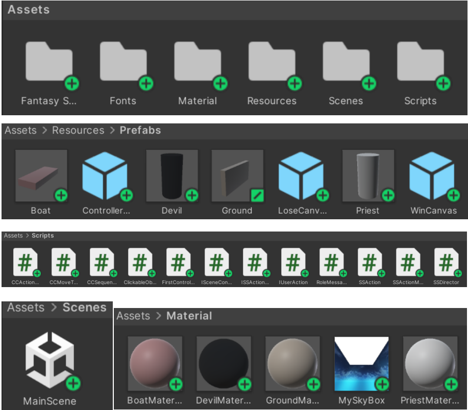
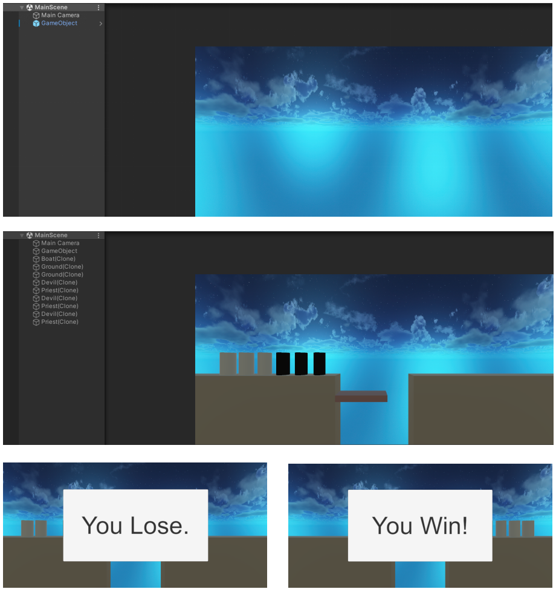
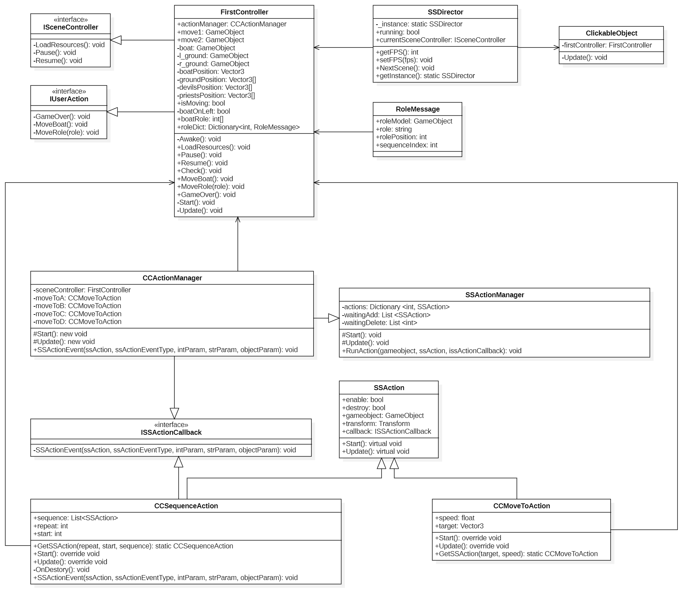

# 【Unity】《牧师与魔鬼》(动作分离版) - Lab3 博客 

Video URL：https://www.bilibili.com/video/BV1vW15YXE5z/

---

## 一、游戏要求 

阅读以下游戏脚本

>Priests and Devils
>
>Priests and Devils is a puzzle game in which you will help the Priests and Devils to cross the river within the time limit. There are 3 priests and 3 devils at one side of the river. They all want to get to the other side of this river, but there is only one boat and this boat can only carry two persons each time. And there must be one person steering the boat from one side to the other side. In the flash game, you can click on them to move them and click the go button to move the boat to the other direction. If the priests are out numbered by the devils on either side of the river, they get killed and the game is over. You can try it in many > ways. Keep all priests alive! Good luck!

程序需要满足的要求：

1. 列出游戏中提及的事物（Objects）;

2. 用表格列出玩家动作表（规则表），注意，动作越少越好;
  
3. 请将游戏中对象做成预制;
 
4. 在场景控制器 LoadResources 方法中加载并初始化长方形、正方形、球及其色彩代表游戏中的对象;
   
5. 使用 C# 集合类型 有效组织对象;
   
6. 整个游戏仅 主摄像机 和 一个 Empty 对象，其他对象必须代码动态生成！！！整个游戏不许出现 Find 游戏对象， SendMessage 这类突破程序结构的 通讯耦合 语句;

7. 请使用课件架构图编程，不接受非 MVC 结构程序;

8. 注意细节，例如：船未靠岸，牧师与魔鬼上下船运动中，均不能接受用户事件！

## 二、游戏设计 

1. 列出游戏中提及的事物（Objects）：

   牧师，魔鬼，船，两岸；

2. 用表格列出玩家动作表（规则表），注意，动作越少越好;

   | 动作 | 执行条件 | 执行结果 |
   | ---- | ---- | ---- |
   | 点击岸上的牧师或魔鬼 | 没有任何对象（船、牧师与魔鬼）处于运动状态且船上存在空位 | 牧师或魔鬼跳上船 |
   | 点击船 | 没有任何对象处于运动状态 | 船移动到对岸 |
   | 点击船上的牧师或魔鬼 | 没有任何对象处于运动状态 | 牧师或魔鬼跳上船靠近的岸 |

3. 请将游戏中对象做成预制;

4. 在场景控制器 LoadResources 方法中加载并初始化长方形、正方形、球及其色彩代表游戏中的对象;

   该游戏项目的 Assets 的内容如下图所示：
   
   

5. 使用 C# 集合类型 有效组织对象;

```cs
  public class RoleMessage : MonoBehaviour
  {
      public string role;  // "Priest" or "Devil"
      public int sequenceIndex;  // At the initial position, the priest's sequenceIndex value is 1 ~ 3, while the devil's sequenceIndex value is 4 ~ 6
      public GameObject roleModel;
      public int rolePosition = 1;  // 1 means the object is on the left bank, 0 means the object is on the ship, and -1 means the object is on the right bank
  
      public RoleMessage(int index, GameObject gameObject, string str)
      {
          role = str;
          sequenceIndex = index;
          roleModel = gameObject;
      }
  }

  // Keys:GameObject.GetInstanceID()    Values:RoleMessage
  public Dictionary<int, RoleMessage> roleDict = new Dictionary<int, RoleMessage>();
```

6. 整个游戏仅 主摄像机 和 一个 Empty 对象，其他对象必须代码动态生成！！！整个游戏不许出现 Find 游戏对象， SendMessage 这类突破程序结构的 通讯耦合 语句;

   该游戏项目运行前后的如下图所示：
   
   

8. 请使用课件架构图编程，不接受非 MVC 结构程序;

   

## 三、游戏实现 
